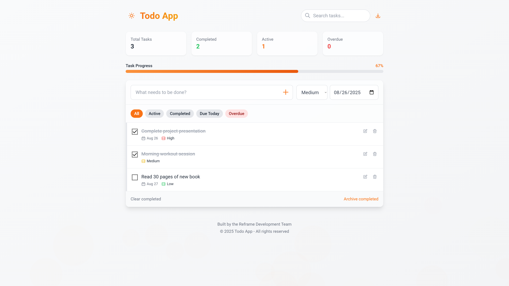

# ✅ Advanced Todo App

A beautiful and powerful **Todo App** built with **HTML, TailwindCSS, and JavaScript**.  
It helps you manage tasks efficiently with categories, priorities, search, due dates, progress tracking, archiving, and even **CSV export**.

---

## ✨ Features
- **Task Management**:
  - Add, edit, and delete tasks.
  - Assign **priority levels**: Low, Medium, High.
  - Set **due dates** for tasks.
- **Categories & Filters**:
  - View tasks by: All, Active, Completed, Due Today, Overdue.
  - Archive completed tasks.
- **Search**: Quickly find tasks by title.
- **Pin & Organize**: Keep important tasks visible.
- **Progress Tracking**: Live progress bar with task statistics.
- **Task States**: Active, Completed, Overdue.
- **CSV Export**: Download your tasks as a `.csv` file for backup or sharing.
- **Responsive Design**: Optimized for desktop and mobile.
- **Dark/Light Mode** toggle.
- **Beautiful UI**:
  - Glassmorphism  
  - Gradient highlights  
  - Smooth animations  

---

## 🛠 How to Use
1. Clone this repository or download the file:
    ```bash
    git clone https://github.com/your-username/todo-app-advanced.git
    ```
2. Open `index.html` in your browser.  
3. Start adding tasks with priorities, due dates, and categories.  
4. Use filters, search, and archive as needed.  
5. Export your tasks anytime as **CSV** with one click.  

---

## 📂 Project Structure
```
todo-app-advanced/
│
├── index.html # Main single-file Todo App
├── scripts.js # App logic
├── styles.css # Custom styles
├── README.md
└── screenshot.png
```


---

## 📸 Screenshots


---

## 📜 License
This project is licensed under the **MIT License** – free to use, modify, and share.

---

## 💡 Future Improvements
- Cloud sync (Google Drive, Dropbox).
- Notifications & reminders for due tasks.
- User authentication with multiple profiles.
- Export to PDF in addition to CSV.